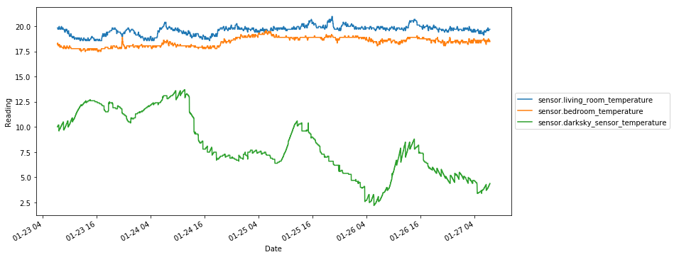
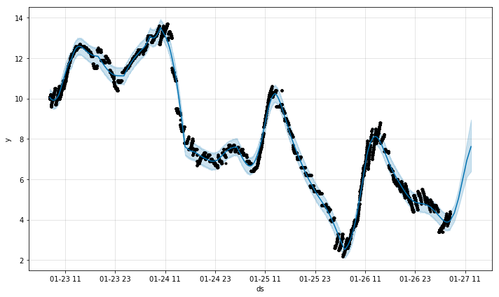

Jupyter notebook [Usage of detective.ipynb](https://github.com/robmarkcole/HASS-data-detective/blob/development/Usage%20of%20detective.ipynb) shows usage of the data detective package.

**References**
* https://facebook.github.io/prophet/


```python
import detective.core as detective
import detective.helpers as helpers
from fbprophet import Prophet
import pandas as pd
import seaborn as sns
import matplotlib.pyplot as plt
%matplotlib inline
```

To load from a local db, we just need the path


```python
db_path = 'Users/robincole/Documents/Home-assistant_database/home-assistant_v2.db'
DB_URL = 'sqlite:////' + db_path
```

Alternatively, to load from a cloud database we load from a json file containing the url as the url contains our credentials and we want to lkeep these a secret. To learn how the Google CLoud SQL recorder can be setup checkout https://github.com/robmarkcole/HASS-Google-Cloud-SQL


```python
# For cloud database with secret credentials, load from json. Time to load vaires, up to 3 mins.
filename = '/Users/robincole/Desktop/hass_db_url.json'
DB_URL = helpers.load_url(filename)
```

## Load the db data

We use the DataParser class to load data from the database. This class performs the SQL queries and parses the returned data. The class holds the master pandas dataframe master_df.


```python
parser = detective.DataParser(DB_URL)
```
Lets create an object holding the numerical sensor


```python
sensors_num = detective.NumericalSensors(parser.master_df)
```

We can access the list of sensor entities using the list_sensors attribute


```python
sensors_num.entities[0:10]
```

    ['sensor.bme680humidity',
     'sensor.bme680pressure',
     'sensor.next_train_in',
     'sensor.living_room_temperature',
     'sensor.darksky_sensor_temperature',
     'sensor.mean_temperature',
     'sensor.bme680temperature',
     'sensor.bedroom_temperature',
     'sensor.next_train_to_wim',
     'sensor.network_up']


Now lets look at the dataframe


```python
sensors_num.data.head()
```

<table border="1" class="dataframe">
  <thead>
    <tr style="text-align: right;">
      <th>entity</th>
      <th>sensor.bayes_probability</th>
      <th>sensor.bedroom_temperature</th>
      <th>sensor.blink_blink_camera_percy_notifications</th>
      <th>sensor.blink_blink_camera_percy_temperature</th>
      <th>sensor.bme680air_qual</th>
      <th>sensor.bme680humidity</th>
      <th>sensor.bme680pressure</th>
      <th>sensor.bme680temperature</th>
      <th>sensor.cpu_load_total</th>
      <th>sensor.darksky_sensor_precip_probability</th>
      <th>...</th>
      <th>sensor.mean_temperature</th>
      <th>sensor.memory_usage_real</th>
      <th>sensor.network_up</th>
      <th>sensor.next_train_in</th>
      <th>sensor.next_train_to_wim</th>
      <th>sensor.robins_iphone_battery_level</th>
      <th>sensor.speedtest_download</th>
      <th>sensor.time_in_bed</th>
      <th>sensor.volume_used_volume_1</th>
      <th>sensor.work_to_home</th>
    </tr>
    <tr>
      <th>last_changed</th>
      <th></th>
      <th></th>
      <th></th>
      <th></th>
      <th></th>
      <th></th>
      <th></th>
      <th></th>
      <th></th>
      <th></th>
      <th></th>
      <th></th>
      <th></th>
      <th></th>
      <th></th>
      <th></th>
      <th></th>
      <th></th>
      <th></th>
      <th></th>
      <th></th>
    </tr>
  </thead>
  <tbody>
    <tr>
      <th>2018-01-23 07:16:58</th>
      <td>0.2</td>
      <td>18.190000</td>
      <td>1.0</td>
      <td>18.0</td>
      <td>7549489.0</td>
      <td>45.957</td>
      <td>1016.85</td>
      <td>22.07</td>
      <td>2.0</td>
      <td>0.0</td>
      <td>...</td>
      <td>18.120000</td>
      <td>53.0</td>
      <td>5.5</td>
      <td>1.000000</td>
      <td>1.0</td>
      <td>100.0</td>
      <td>10.79</td>
      <td>3.58</td>
      <td>19.7</td>
      <td>38.0</td>
    </tr>
    <tr>
      <th>2018-01-23 07:16:59</th>
      <td>0.2</td>
      <td>18.190000</td>
      <td>1.0</td>
      <td>18.0</td>
      <td>7549489.0</td>
      <td>45.957</td>
      <td>1016.85</td>
      <td>22.07</td>
      <td>2.0</td>
      <td>0.0</td>
      <td>...</td>
      <td>18.120000</td>
      <td>53.0</td>
      <td>5.5</td>
      <td>1.000000</td>
      <td>28.0</td>
      <td>100.0</td>
      <td>10.79</td>
      <td>0.00</td>
      <td>19.7</td>
      <td>38.0</td>
    </tr>
    <tr>
      <th>2018-01-23 07:17:04</th>
      <td>0.2</td>
      <td>18.190000</td>
      <td>1.0</td>
      <td>18.0</td>
      <td>7549489.0</td>
      <td>45.957</td>
      <td>1016.85</td>
      <td>22.07</td>
      <td>2.0</td>
      <td>0.0</td>
      <td>...</td>
      <td>18.120000</td>
      <td>53.0</td>
      <td>5.5</td>
      <td>1.000000</td>
      <td>28.0</td>
      <td>100.0</td>
      <td>10.79</td>
      <td>0.00</td>
      <td>19.7</td>
      <td>38.0</td>
    </tr>
    <tr>
      <th>2018-01-23 07:17:20</th>
      <td>0.2</td>
      <td>18.240909</td>
      <td>1.0</td>
      <td>18.0</td>
      <td>7549489.0</td>
      <td>45.957</td>
      <td>1016.85</td>
      <td>22.07</td>
      <td>2.0</td>
      <td>0.0</td>
      <td>...</td>
      <td>18.035455</td>
      <td>53.0</td>
      <td>5.5</td>
      <td>5.909091</td>
      <td>28.0</td>
      <td>100.0</td>
      <td>10.79</td>
      <td>0.00</td>
      <td>19.7</td>
      <td>38.0</td>
    </tr>
    <tr>
      <th>2018-01-23 07:17:21</th>
      <td>0.2</td>
      <td>18.330000</td>
      <td>1.0</td>
      <td>18.0</td>
      <td>7549489.0</td>
      <td>45.957</td>
      <td>1016.85</td>
      <td>22.07</td>
      <td>2.0</td>
      <td>0.0</td>
      <td>...</td>
      <td>18.150000</td>
      <td>53.0</td>
      <td>5.5</td>
      <td>28.000000</td>
      <td>28.0</td>
      <td>100.0</td>
      <td>10.79</td>
      <td>0.00</td>
      <td>19.7</td>
      <td>37.0</td>
    </tr>
  </tbody>
</table>
<p>5 rows × 28 columns</p>
</div>


Lets now check for correlations in the data using the all_corrs() method


```python
corrs = sensors_num.correlations()
```


```python
corrs[(corrs['value'] > 0.5) | (corrs['value'] < -0.5)]
```

<table border="1" class="dataframe">
  <thead>
    <tr style="text-align: right;">
      <th></th>
      <th>value</th>
    </tr>
  </thead>
  <tbody>
    <tr>
      <th>sensor.electric_charger_distance-sensor.bme680pressure</th>
      <td>1.000000</td>
    </tr>
    <tr>
      <th>sensor.bme680pressure-sensor.bme680humidity</th>
      <td>1.000000</td>
    </tr>
    <tr>
      <th>sensor.bme680humidity-sensor.electric_charger_distance</th>
      <td>1.000000</td>
    </tr>
    <tr>
      <th>sensor.bme680humidity-sensor.volume_used_volume_1</th>
      <td>1.000000</td>
    </tr>
    <tr>
      <th>sensor.volume_used_volume_1-sensor.bme680pressure</th>
      <td>1.000000</td>
    </tr>
    <tr>
      <th>sensor.bme680temperature-sensor.homeassistant_v2db</th>
      <td>1.000000</td>
    </tr>
    <tr>
      <th>sensor.electric_charger_distance-sensor.volume_used_volume_1</th>
      <td>1.000000</td>
    </tr>
    <tr>
      <th>sensor.next_train_to_wim-sensor.next_train_in</th>
      <td>0.991736</td>
    </tr>
    <tr>
      <th>sensor.blink_blink_camera_percy_temperature-sensor.mean_temperature</th>
      <td>0.842227</td>
    </tr>
    <tr>
      <th>sensor.bedroom_temperature-sensor.mean_temperature</th>
      <td>0.838251</td>
    </tr>
    <tr>
      <th>sensor.hall_temperature-sensor.mean_temperature</th>
      <td>0.788017</td>
    </tr>
    <tr>
      <th>sensor.mean_temperature-sensor.living_room_temperature</th>
      <td>0.763768</td>
    </tr>
    <tr>
      <th>sensor.living_room_temperature-sensor.bedroom_temperature</th>
      <td>0.694223</td>
    </tr>
    <tr>
      <th>sensor.bedroom_temperature-sensor.blink_blink_camera_percy_temperature</th>
      <td>0.642330</td>
    </tr>
    <tr>
      <th>sensor.hall_temperature-sensor.blink_blink_camera_percy_temperature</th>
      <td>0.631942</td>
    </tr>
    <tr>
      <th>sensor.iphone_battery_level-sensor.mean_temperature</th>
      <td>0.518993</td>
    </tr>
    <tr>
      <th>sensor.darksky_sensor_temperature-sensor.mean_temperature</th>
      <td>-0.547334</td>
    </tr>
    <tr>
      <th>sensor.darksky_sensor_temperature-sensor.bedroom_temperature</th>
      <td>-0.551891</td>
    </tr>
    <tr>
      <th>sensor.home_to_waterloo-sensor.robins_iphone_battery_level</th>
      <td>-0.568545</td>
    </tr>
    <tr>
      <th>sensor.iphone_battery_level-sensor.darksky_sensor_temperature</th>
      <td>-0.736020</td>
    </tr>
    <tr>
      <th>sensor.volume_used_volume_1-sensor.bme680temperature</th>
      <td>-1.000000</td>
    </tr>
    <tr>
      <th>sensor.bme680temperature-sensor.electric_charger_distance</th>
      <td>-1.000000</td>
    </tr>
    <tr>
      <th>sensor.bme680temperature-sensor.bme680pressure</th>
      <td>-1.000000</td>
    </tr>
    <tr>
      <th>sensor.bme680temperature-sensor.bme680humidity</th>
      <td>-1.000000</td>
    </tr>
    <tr>
      <th>sensor.homeassistant_v2db-sensor.electric_charger_distance</th>
      <td>-1.000000</td>
    </tr>
    <tr>
      <th>sensor.homeassistant_v2db-sensor.bme680pressure</th>
      <td>-1.000000</td>
    </tr>
    <tr>
      <th>sensor.homeassistant_v2db-sensor.volume_used_volume_1</th>
      <td>-1.000000</td>
    </tr>
    <tr>
      <th>sensor.homeassistant_v2db-sensor.bme680humidity</th>
      <td>-1.000000</td>
    </tr>
  </tbody>
</table>
</div>


Unsurprisingly the mean temperature is strongly correlated with all of the temperature sensors.

Interestingly my iphone battery level is somewhat inversely correlated with the travel time from home to waterloo, which gets longer late at night when my battery level is more likely to be low.

#### Plot sensor data
Convenience to plot a sensor data.


```python
to_plot = ['sensor.living_room_temperature',
           'sensor.bedroom_temperature',
           'sensor.darksky_sensor_temperature']
```


```python
fig = sensors_num.plot(to_plot)
```





#### Pairplot
A seaborn pair plot to show correlations.


```python
sns.pairplot(sensors_num.data[to_plot]);
```


#### Prediction with prophet
Lets do some forecasting using prophet. We require a single sensor which is a pandas data series object.


```python
sensor_ds = sensors_num.data['sensor.darksky_sensor_temperature']
sensor_ds.plot()
```


```python
pred1 = detective.Prediction(sensor_ds)
```

Create a prophet model


```python
print(pred1.prophet_model.__doc__)
```


            Make a propet model for the given sensor for the number of periods.

            Parameters
            ----------

            periods : int
                The default period is 0 (no forecast)

            freq : str
                Unit of time, defaults to seconds.


```python
%%time
pred1.prophet_model(periods=5, freq='H')
```
    CPU times: user 17.1 s, sys: 265 ms, total: 17.4 s
    Wall time: 17.6 s


```python
pred1.plot_future()
```





```python
pred1.plot_components()
```


Clearly the daily trend is for the warmest temperatures at early afternoon
